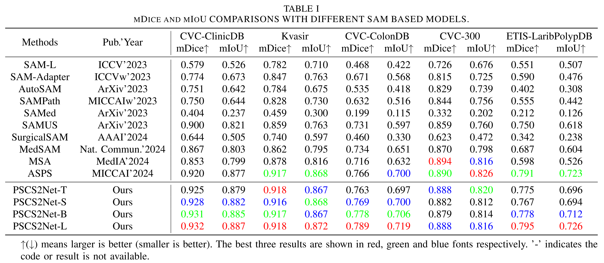
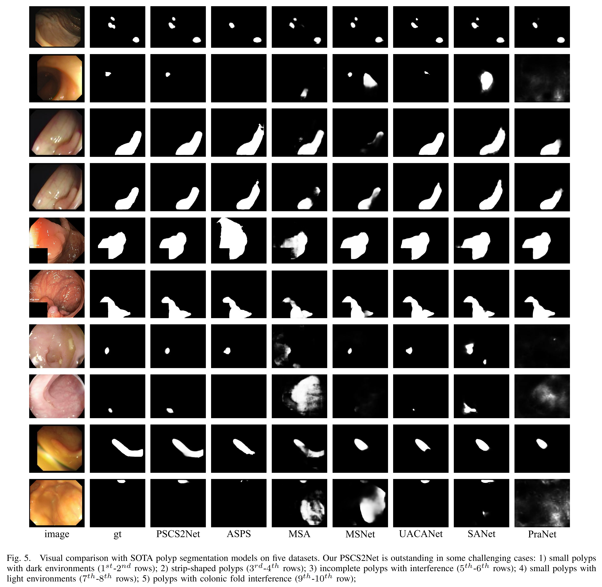

# PSCS2Net: An Polyp Segmentation Method Based on Augmented Segment Anything Model 2


## Requirements
```
conda create --name PSCS2Net python=3.10
conda activate PSCS2Net
pip install torch==2.5.1 torchvision==0.20.1 torchaudio==2.5.1 --index-url https://download.pytorch.org/whl/cu118
pip install mmcv==2.2.0
pip install mmengine==0.10.7
pip install tqdm
pip install opencv-python
pip install albumentations==1.3.0
```

## Dataset
We conduct extensive experiments on five polyp segmentation datasets following [PraNet](https://github.com/DengPingFan/PraNet)

## Training
```
python train.py --exp_name 'exp' --polyp_dir "data/TrainDataset/"
```

## Evaluating
```
python infer.py --exp_name 'exp' --dataset_name 'CVC-300'  --test_seg_dir "data/TestDataset/CVC-300/"   
python infer.py --exp_name 'exp' --dataset_name 'CVC-ClinicDB'  --test_seg_dir "data/TestDataset/CVC-ClinicDB/"   
python infer.py --exp_name 'exp' --dataset_name 'CVC-ColonDB'  --test_seg_dir "data/TestDataset/CVC-ColonDB/"   
python infer.py --exp_name 'exp' --dataset_name 'ETIS-LaribPolypDB'  --test_seg_dir "data/TestDataset/ETIS-LaribPolypDB/"   
python infer.py --exp_name 'exp' --dataset_name 'Kvasir'  --test_seg_dir "data/TestDataset/Kvasir/"  

```
You can directly run the `train.sh` to train and evaluate our framework.

## Evaluation toolbox
Matlab version: [PraNet](https://github.com/DengPingFan/PraNet)  
Python version: [UACANet](https://github.com/plemeri/UACANet)

## Checkpoints
[SAM2](https://github.com/facebookresearch/sam2/)  
[SegNext](https://drive.google.com/file/d/1QfzketbV3GJJFbDcJXsfON0v4Emza_IC/view?usp=drive_link)  
[PSCS2Net](https://drive.google.com/file/d/1h6eqA2u-DCFE_mKJDLiro3Wldo0mgbWV/view?usp=drive_link)  

## Pre-computed maps
[Here](https://drive.google.com/drive/folders/1RdobIUs4SqY7cYFgqg_XSxsbEXP9R_df?usp=drive_link)

## Benchmark



## Visual results


## Citation
Please cite our paper and star our project if you find the work is useful
```

```
